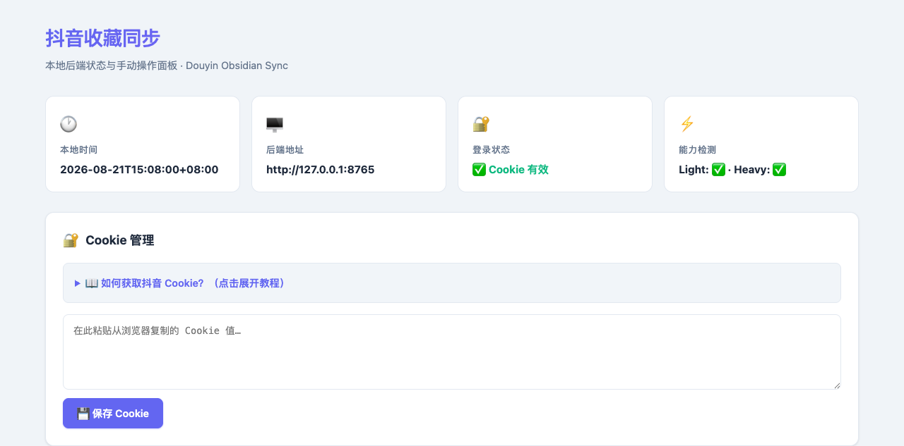
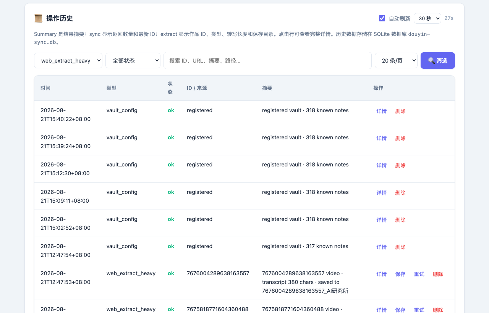
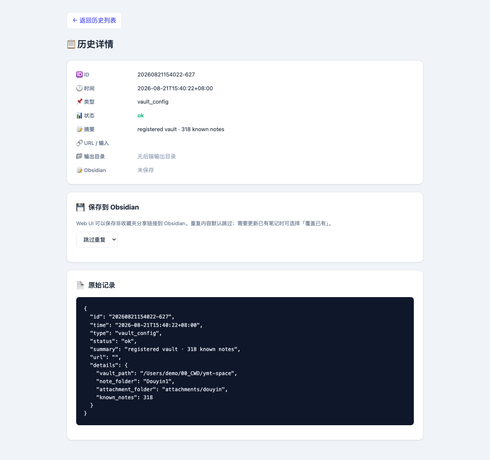

# Douyin Favorites Sync Backend

[中文文档](#中文文档) | [English](#english)

---

## English

Local Python/FastAPI backend service for the [Douyin Favorites Sync](https://github.com/yumingtao/douyin-favorites-sync) Obsidian plugin.

Fetches Douyin favorites, extracts metadata, downloads watermark-free videos, and performs Whisper speech transcription — all served via a local REST API with a built-in Web UI.

### Features

- **FastAPI REST API** — All endpoints documented via Swagger (`/docs`)
- **Web Dashboard** — Built-in Web UI for operation history, batch retry, and Cookie management
- **SQLite Storage** — Persistent history and content index
- **Two Modes**
  - ⚡ **Light** — Extract links, covers, and captions only (fast)
  - 🎬 **Heavy** — Download watermark-free videos + Whisper speech transcription
- **Browser-based Request Signing** — Signs requests via an `agent-browser` Douyin session with automatic recovery: if the session dies, the backend relaunches it from a saved state file and retries (no manual re-login needed)

### Web UI

Cookie management, manual sync preview, manual extract/import, and operation history — all in the browser:



Full-page view: [web-ui-full.png](docs/screenshots/web-ui-full.png)

Operation history — filters & per-entry retry:



Entry detail page — save to Obsidian / re-extract / raw record:



### Architecture

```
Obsidian Plugin (TypeScript)        Local Backend (Python/FastAPI)
┌───────────────────────┐          ┌────────────────────────────┐
│ Ribbon / Commands     │          │ FastAPI + SQLite           │
│ Settings Tab          │ ◄──────► │ /api/health                │
│ Vault Writer          │  HTTP    │ /api/sync/favorites        │
│ Status Bar            │          │ /api/jobs/extract (async)  │
└───────────────────────┘          │ /api/config/vault          │
                                   │ Web UI (127.0.0.1:8765)    │
        agent-browser CLI ────────►│ Signing (self-healing      │
        (douyin.com login session) │ douyin.com session)        │
                                   └────────────────────────────┘
```

### Installation

**Requirements**: Python 3.10+, [Node.js 18+](https://nodejs.org/), [agent-browser](https://github.com/vercel-labs/agent-browser) CLI (request signing)

```bash
# 0. Install the signing browser CLI
npm install -g agent-browser
agent-browser install   # downloads browser binaries (first time only)
```

```bash
# 1. Clone the repository
git clone https://github.com/yumingtao/douyin-favorites-sync-backend.git
cd douyin-favorites-sync-backend

# 2. Install dependencies
pip install -r requirements.txt

# For Heavy mode (video download + transcription), also install:
pip install -r requirements-heavy.txt

# 3. Start the backend service
python -m backend
# Service runs at http://127.0.0.1:8765

# 4. One-time login setup: create the signing browser session
agent-browser --session douyin-sign \
  open "https://www.douyin.com/user/self?showTab=favorite_collection"
# Scan the QR code to log in, then persist the session state:
agent-browser --session douyin-sign state save \
  ~/.agent-browser/sessions/douyin-sign.json
```

> The saved state keeps the login alive across restarts. The backend
> refreshes it automatically after successful syncs (throttled to every
> 30 min). If the session dies anyway, sync triggers self-healing:
> relaunch + state restore + one retry — no manual QR scan unless the
> Douyin login itself expired.

Or use the provided startup script (auto-creates a venv, installs deps,
restarts on port 8765):

```bash
chmod +x start-backend.sh
./start-backend.sh
```

### Environment Variables

| Variable | Description | Default |
|----------|-------------|---------|
| `DOUYIN_SYNC_ROOT` | Root directory for data storage | `.` (current directory) |
| `DOUYIN_COOKIE` | Douyin cookie string, optional fallback (can also set via Web UI) | — |
| `DOUYIN_SIGN_SESSION` | agent-browser session name used for signing | `douyin-sign` |
| `DOUYIN_SIGN_STATE_FILE` | Session state file for login recovery | `~/.agent-browser/sessions/douyin-sign.json` |
| `DOUYIN_SIGN_ASSETS_FILE` | Auto-managed signing cache file | `data/sign-assets.json` |

### Cookie (Optional Fallback)

Favorites sync authenticates through the `agent-browser` signing session
(set up in step 4 above). A raw cookie is only an optional fallback for
misc endpoints — paste it in the Web UI's "Cookie Management" section
(`F12` → Network → any `douyin.com` request → **Request Headers** →
`Cookie`). Cookie validity is typically 1–2 weeks.

### API Endpoints

Swagger docs available at `/docs`:

| Endpoint | Method | Description |
|----------|--------|-------------|
| `/api/health` | GET | Health check |
| `/api/auth/qrcode` | GET | Get login QR code (may be unavailable — use the agent-browser session instead) |
| `/api/auth/status` | GET | Check login status |
| `/api/auth/cookie` | POST | Save cookie manually |
| `/api/sync/favorites` | POST | Sync favorites list |
| `/api/video/extract` | POST | Extract single video |
| `/api/manual-import` | POST | Manual import from share text |
| `/api/jobs/extract` | POST | Create async extraction job |
| `/api/jobs/{job_id}` | GET | Query job status |
| `/api/history` | GET | Query operation history |
| `/api/history/{event_id}` | GET/DELETE | Get or delete history entry |
| `/api/history/{event_id}/save` | POST | Save to Obsidian |
| `/api/history/{event_id}/retry-mark` | POST | Mark retry result |
| `/api/history/{event_id}/retry-sync` | POST | Batch retry from history (used by Web UI) |
| `/api/content/{douyin_id}` | GET | Query content index |
| `/api/config/vault` | POST | Register vault config |
| `/`, `/history/{id}` | GET | Web UI pages |
| `/web/sync`, `/web/extract` | POST | Web UI form handlers |

### Project Structure

```
douyin-favorites-sync-backend/
├── backend/
│   ├── __init__.py
│   ├── __main__.py        # Entry point: uvicorn server
│   ├── app.py             # FastAPI app + Web UI
│   ├── douyin_client.py   # Douyin API client + signing session self-healing
│   ├── extractor.py       # Content extraction logic
│   ├── state.py           # SQLite state management
│   ├── vault_writer.py    # Obsidian vault integration
│   ├── transcriber.py     # Whisper speech transcription
│   └── abogus_signer.py   # Request signing
├── data/                  # sign-assets.json (runtime cache, gitignored)
├── scripts/
│   └── phase0_fetch_favorites.py
├── requirements.txt
├── requirements-heavy.txt
├── start-backend.sh
└── README.md
```

---

## 中文文档

[Douyin Favorites Sync](https://github.com/yumingtao/douyin-favorites-sync) Obsidian 插件的本地 Python/FastAPI 后端服务。

拉取抖音收藏、提取元数据、下载无水印视频、执行 Whisper 语音转写，通过本地 REST API 和内置 Web UI 提供服务。

### 功能特性

- **FastAPI REST API** — 所有接口均通过 Swagger 文档说明（`/docs`）
- **Web 管理面板** — 内置 Web UI，支持操作历史、批量重试、Cookie 管理
- **SQLite 存储** — 持久化历史记录和内容索引
- **两种模式**
  - ⚡ **Light** — 仅提取链接、封面和文案，速度快
  - 🎬 **Heavy** — 下载无水印视频 + Whisper 语音转写
- **浏览器出签** — 通过 `agent-browser` 抖音会话签名并支持自愈：会话失活时自动从状态文件重建并重试，无需人工重新扫码

### Web 管理界面

Cookie 管理、手动同步预览、手动提取/导入、操作历史，浏览器打开即用：


完整长图：[web-ui-full.png](docs/screenshots/web-ui-full.png)

操作历史（筛选 / 逐条重试）：


条目详情页（保存到 Obsidian / 重新提取 / 原始记录）：


### 安装

**环境要求**：Python 3.10+、[Node.js 18+](https://nodejs.org/)、[agent-browser](https://github.com/vercel-labs/agent-browser) CLI（请求签名）

```bash
# 0. 安装签名浏览器 CLI
npm install -g agent-browser
agent-browser install   # 首次运行下载浏览器内核

# 1. 克隆仓库
git clone https://github.com/yumingtao/douyin-favorites-sync-backend.git
cd douyin-favorites-sync-backend

# 2. 安装依赖
pip install -r requirements.txt

# Heavy 模式（视频下载+转写）需额外安装：
pip install -r requirements-heavy.txt

# 3. 启动后端服务
python -m backend
# 服务运行在 http://127.0.0.1:8765

# 4. 一次性登录：创建签名浏览器会话
agent-browser --session douyin-sign \
  open "https://www.douyin.com/user/self?showTab=favorite_collection"
# 扫码登录抖音后，持久化会话状态：
agent-browser --session douyin-sign state save \
  ~/.agent-browser/sessions/douyin-sign.json
```

> 保存的状态可跨重启保持登录。后端在成功同步后会自动刷新状态（每 30 分钟限流一次）；若会话意外失效，同步时会自动自愈：重启会话 + 恢复状态 + 重试一次——除非抖音登录本身过期，否则无需手动扫码。

Web 面板（`http://127.0.0.1:8765`）还提供可选的 Cookie 管理作为兜底。

也可以使用启动脚本：

```bash
chmod +x start-backend.sh
./start-backend.sh
```

### 环境变量

| 变量 | 说明 | 默认值 |
|------|------|--------|
| `DOUYIN_SYNC_ROOT` | 数据存储根目录 | `.`（当前目录） |
| `DOUYIN_COOKIE` | 抖音 Cookie 字符串，可选回退（也可通过 Web UI 设置） | — |
| `DOUYIN_SIGN_SESSION` | 出签使用的 agent-browser 会话名 | `douyin-sign` |
| `DOUYIN_SIGN_STATE_FILE` | 登录恢复用的会话状态文件 | `~/.agent-browser/sessions/douyin-sign.json` |
| `DOUYIN_SIGN_ASSETS_FILE` | 签名缓存文件（自动管理） | `data/sign-assets.json` |

### Cookie（可选回退）

收藏同步的登录态由 `agent-browser` 出签会话承担（见安装第 4 步）。
原始 Cookie 仅作为部分接口的可选回退 —— `F12` → Network → 任一
`douyin.com` 请求 → **Request Headers** → `Cookie`，复制后粘贴到
Web 面板「Cookie 管理」区域即可。Cookie 有效期约 1–2 周。

### 项目结构

```
douyin-favorites-sync-backend/
├── backend/
│   ├── __init__.py
│   ├── __main__.py        # 入口：uvicorn 服务
│   ├── app.py             # FastAPI 应用 + Web UI
│   ├── douyin_client.py   # 抖音 API 客户端 + 出签会话自愈
│   ├── extractor.py       # 内容提取逻辑
│   ├── state.py           # SQLite 状态管理
│   ├── vault_writer.py    # Obsidian Vault 集成
│   ├── transcriber.py     # Whisper 语音转写
│   └── abogus_signer.py   # 请求签名
├── data/                  # sign-assets.json（运行时缓存，已 gitignore）
├── scripts/
│   └── phase0_fetch_favorites.py
├── requirements.txt
├── requirements-heavy.txt
├── start-backend.sh
└── README.md
```

## Disclaimer

This tool is intended for **personal study and research purposes only**. By using this software, you agree that:

- You are solely responsible for ensuring your use complies with the Douyin platform's Terms of Service and all applicable laws and regulations.
- The developer does not encourage, endorse, or facilitate any form of commercial data scraping, bulk downloading, or redistribution of copyrighted content.
- The developer assumes no liability for any consequences arising from the use of this tool, including but not limited to account suspension, data loss, or legal action.

This project is an independent implementation and is not affiliated with or endorsed by Douyin / ByteDance.

### 免责声明

本工具**仅供个人学习研究使用**。使用本软件即表示您同意：

- 您需自行确保使用行为符合抖音平台服务协议及所有适用的法律法规。
- 开发者不鼓励、不支持任何形式的商业性数据采集、批量下载或受版权保护内容的再分发。
- 开发者不对使用本工具产生的任何后果承担责任，包括但不限于账号封禁、数据丢失或法律诉讼。

本项目为独立实现，与抖音 / 字节跳动无任何关联或授权。

## License

[MIT](LICENSE)
